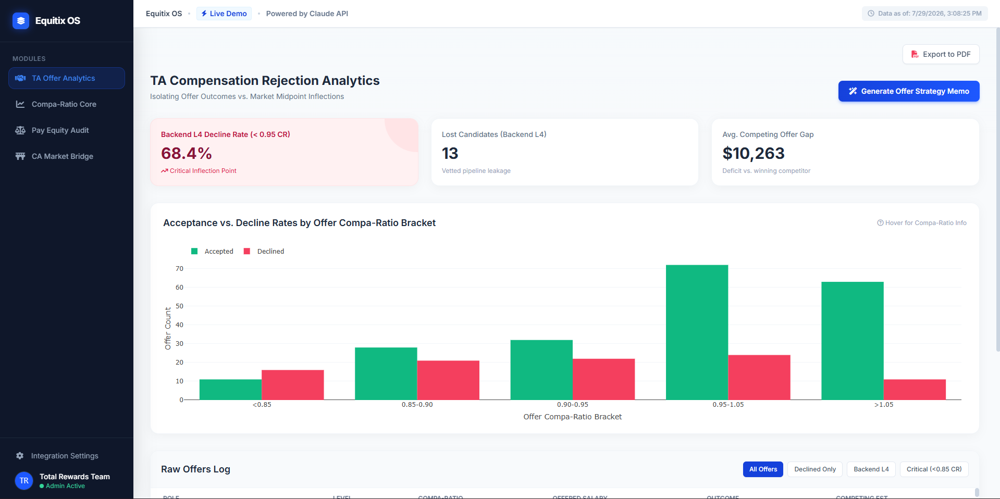
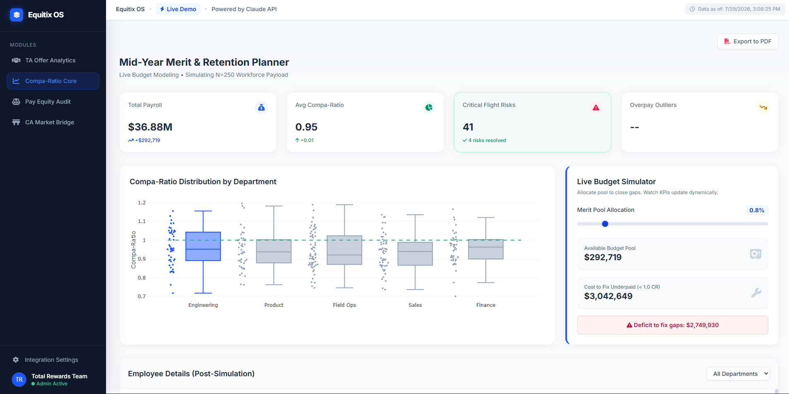
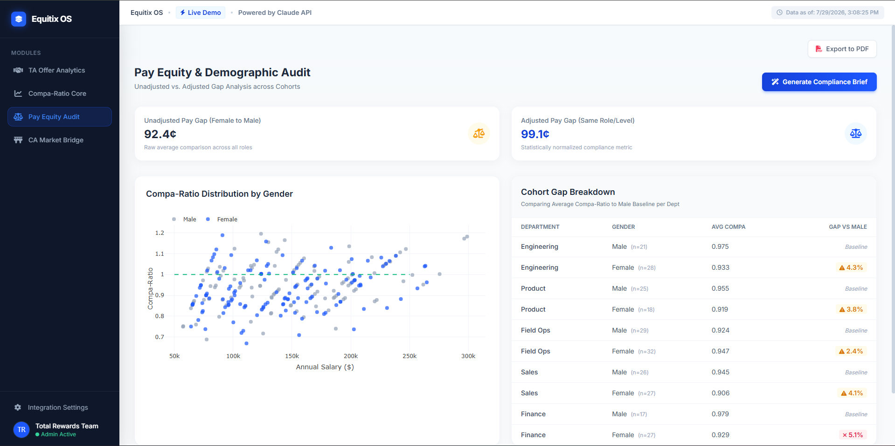

# Equitix OS — People Analytics Platform

**Live Demo:** [https://khanadeeb1.github.io/equitix-os/]

<p align="center">
  
  
  
  
  
</p>

## The Problem This Solves

High-growth tech companies frequently lose top technical talent because initial offers are unknowingly priced below the current market inflection point. Traditional HRIS platforms struggle to present this context; they track whether a candidate declined, but rarely visualize *why* based on real-time compa-ratios. Equitix OS bridges this gap, allowing HR and Talent Acquisition teams to instantly identify compensation bleeding-edges and generate data-backed budget justification memos for hiring managers.

## Architecture

This platform utilizes a decoupled frontend/backend design to ensure the presentation layer remains blazing fast while handling robust data processing behind the scenes.

*   **`index.html`** — The executive-facing dashboard built entirely in Vanilla JS and Tailwind CSS, leveraging Plotly.js for interactive visualizations.
*   **`data_engine.py`** — The compensation data pipeline (Python, Pandas, NumPy) responsible for mathematically modeling synthetic employee records, retention risks, and offer probabilities.
*   **`llm_service.py`** — The AI memo generation backend that integrates the Anthropic Claude API (Python SDK) to synthesize payload data into strategic briefs.

## Modules

### 🤝 TA Offer Analytics
*(The Opendoor Solution)*
This module isolates candidate offer outcomes (Accepted vs. Declined) against market midpoint inflections. It empowers Hiring Managers and TA leaders to proactively justify competitive initial offers rather than restarting costly 45-day recruiting cycles, explicitly highlighting the exact compa-ratio threshold where technical candidates begin declining offers.


### 📈 Compa-Ratio Core
A mid-year merit and retention planner modeling a simulated 250-employee workforce payload. It features a live budget simulator allowing leadership to dynamically adjust merit pool allocations and instantly calculates the total payroll impact while visually tracking the real-time resolution of critical flight risks among underpaid high-performers.


### ⚖️ Pay Equity Audit
Analyzes demographic compensation data to surface unadjusted and adjusted pay gaps across the organization. It ensures statistically normalized compliance, proactively flags sub-cohorts requiring review (e.g., comparing female vs. male compa-ratios within the exact same department), and uses AI to draft a formal legal/CPO compliance brief.


### 🌉 CA Market Bridge
A cross-border compensation normalization tool modeling US-to-Canada pay transitions. It highlights why raw USD-to-CAD exchange rates heavily underprice Toronto tech talent by adjusting for local market benchmarks and statutory benefit deltas (CPP/EI contributions) to create accurate Canadian total-comp offers.


## Key Insights Modeled

*   **Backend L4 offer decline inflection point** at a 95% compa-ratio, costing an estimated deficit to competing offers.
*   **US-to-Canada compensation gap** for the Toronto tech market, showcasing the necessity of local market alignment over raw FX conversions.
*   **Budget scenario modeling** for mid-year comp reviews, allowing executives to see if a 3% vs 4% pool can actually close their high-retention risk gaps.
*   **Adjusted vs. unadjusted pay equity gaps,** demonstrating strong systemic equity when controlling for department and job level.

## Known Limitations and Next Steps

*   **Real Rippling API Integration:** The current data is a synthetic pipeline (`data_engine.py`). The next step is a REST API integration using the `compensations.read` scope via the Rippling developer API to pull live workforce data.
*   **Live Radford/Mercer Data Ingestion:** Integrating live market benchmarking software APIs (e.g., The Radford McLagan Compensation Database) to replace static market midpoints with real-time quartile tracking.
*   **Role-Based Access Controls (RBAC):** Implementing Okta/SSO to ensure managers only see compensation data for their direct reports.
*   **Multi-Currency Equity Grant Valuation:** Expanding the total rewards calculator to model fluctuating RSU values and refresh grants for global teams.

## Tech Stack

*   **Frontend:** HTML5, JavaScript (ES6), Tailwind CSS
*   **Data Visualization:** Plotly.js
*   **Backend / Data Pipeline:** Python 3.9+, Pandas, NumPy
*   **AI Synthesis:** Anthropic Claude API (`claude-sonnet-4-6`)

## Running Locally

To run the backend data engine and generate fresh datasets locally:

1.  Ensure Python 3.9+ is installed on your machine.
2.  Install the required dependencies:
    
```bash
    pip install pandas numpy anthropic
